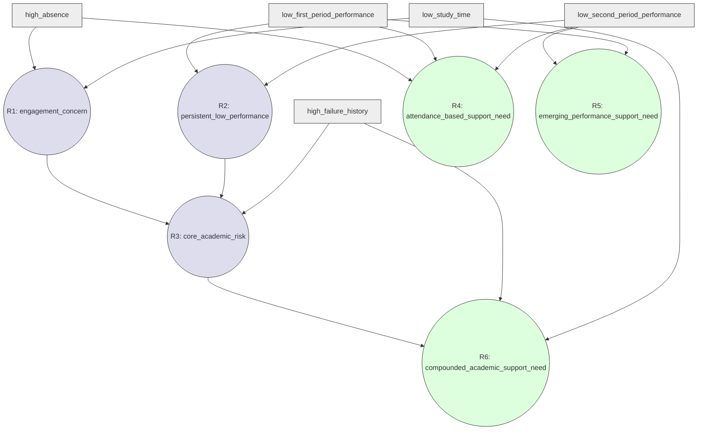

# Rule Base and Dependency Design — Student Academic Advisor

Course: **Basic of AI Programming Skills (DSC 311)**
Project: **Student Academic Advisor**
Design version: **1.1**
Status: **Approved**

This document designs the Production Rule Base and its dependency structure only. It contains no Python, JSON, pseudocode implementation, tests, GUI, API, database, deployment files, or Machine Learning code. This version is approved as the project's Rule Base and dependency-design Source of Truth.

---

## A. Overall Design Recommendation

All Final Conclusions in this rule base share one common semantic direction: each represents a **degree of academic-support need**, reached through a different evidence pathway (attendance-related, second-period/emerging, and compounded/multi-signal). This shared direction is what makes KB-level Maximum and Fuzzy Union aggregation meaningful — every Final CV answers the same underlying question ("how much does this evidence support the student needing support?"), just from a different angle.

**Fuzzy Union is not a probability calculation and does not assume statistical independence between the values being combined.** `U(a,b) = a + b − a×b` is a fuzzy set-theoretic combination rule, applied here purely because the official requirements permit it as an aggregation method — its use makes no claim about the underlying evidence sources being statistically independent, sequential, or unrelated.

The network is a compact but non-trivial six-rule dependency structure: base facts → two Level-1 intermediate conclusions → one Level-2 compounded intermediate conclusion that chains both → three Final conclusions at different levels of certainty and scope. No rule diagnoses a student or makes a causal or crisp claim; every conclusion is phrased as a fuzzy *degree of support need*, not a label, verdict, or exact/exclusive condition.

---

## B. Requirement Classification

**Official Requirements** (from the two binding PDFs):
- At least two knowledge representation techniques, one being production rules
- Rule base substantial and non-trivial; ≥1 nested/parenthesized condition; ≥1 chained rule; clear Intermediate/Final distinction
- Forward or backward chaining, stated explicitly; correct dependency resolution; cycle detection
- Explainability — rules fired, order shown
- Fuzzy facts in [0,1]; AND=min, OR=max, NOT=1−x; FV, CF, CV=FV×CF for every rule; KB-level Maximum and/or Union aggregation over Final CVs
- Producing the final inference-network diagram, using the official inference-network conventions (square / circle-inside-square / plain circle / AND-OR-NOT gates)

**Approved Implementation Decisions** (carried in from Architecture v3.2 and prior approved docs — binding on this design, not re-argued here):
- O-A-V as the second representation technique
- Forward chaining
- Restricted condition syntax, parsed once into an AST, no `IF`/`THEN` tokens, no `eval()`
- Declaration-order topological tie-breaking
- CV (not FV) propagates through intermediate conclusions
- No arbitrary firing threshold; `fired` = FV>0, `contributes` = CV>0
- Duplicate conclusion producers forbidden (not aggregated)
- Intermediate/Final status derived structurally, never manually authored
- The five approved initial fuzzy facts and their membership functions (fixed, not redesigned here)
- `G3` excluded as a premise
- Choosing manual or programmatic diagram production is an Implementation Choice; programmatic generation is optional

**Newly Approved Implementation Decisions** (introduced and approved in this document; they are not official requirements):
- The specific six-rule dependency network and its semantic structure (§D)
- The specific conclusion names and vocabulary (§C)
- The specific CF values and the small, deliberately simple author-assigned CF scale used (§E)
- The decision that all three Final conclusions share an "academic-support need" interpretation, to keep aggregation coherent (§A)

**Deferred Deliverables:**
- A worked numeric FV/CF/CV example using an actual student's fuzzified facts — belongs to implementation/report validation, not this design document

**Optional Enhancements:** none proposed in this document — no GUI, no extra representation technique beyond O-A-V, no programmatic diagram tooling assumed or required.

---

## C. Conclusion Vocabulary

| Attribute | Meaning | Why useful | Structural Status | Produced by | Consumed by |
|---|---|---|---|---|---|
| `engagement_concern` | An engagement-related support signal from either high absences or low study time | Captures a broad, easily-observed engagement signal without requiring both at once | **Intermediate** (has a consumer) | R1 | R3 |
| `persistent_low_performance` | Both first- and second-period performance concern are present, indicating a pattern sustained across periods | Distinguishes a sustained pattern from a single-period signal | **Intermediate** (has a consumer) | R2 | R3 |
| `core_academic_risk` | Persistent low performance combined with a corroborating evidence category — either failure history or engagement concern | The compounded signal — performance concern corroborated by an additional evidence category | **Intermediate** (has a consumer) | R3 | R6 |
| `attendance_based_support_need` | Attendance-based support need when grade-concern membership is limited | Flags an attendance-driven signal distinct from grade-based signals | **Final** (no consumer) | R4 | — |
| `emerging_performance_support_need` | A fuzzy degree of support need associated with second-period performance concern when first-period concern is limited | Flags a possible emerging second-period signal | **Final** (no consumer) | R5 | — |
| `compounded_academic_support_need` | The project's strongest, most compounded academic-support signal | Combines the compounded risk pathway with a direct failure-history/study-time combination | **Final** (no consumer) | R6 | — |

Status above is stated as a *derived* fact of the dependency graph (edges listed in the "Consumed by" column), not an author label — see §F/§H for the graph that produces it. `persistent_low_performance` is now consumed only by R3 (the R2 → R5 edge from version 1.0 has been removed — see §D, R5).

---

## D. Proposed Rule Set

| Decl. # | Rule ID | Condition | Conclusion | CF | Description | Semantic Rationale | Premise Source | Demonstrates |
|---|---|---|---|---|---|---|---|---|
| 1 | R1 | `high_absence OR low_study_time` | `engagement_concern` | 0.70 | Either weak attendance or weak study effort contributes an engagement-related support signal | An OR-combined, broad, stepping-stone signal — either contributing fact alone is treated as moderate evidence | Initial | OR |
| 2 | R2 | `low_first_period_performance AND low_second_period_performance` | `persistent_low_performance` | 0.90 | Two sequential academic-period measurements both supporting low-performance concern provide evidence of persistence across periods | Sustained-pattern evidence across two periods of the same academic measurement — not a claim of statistical independence | Initial | AND |
| 3 | R3 | `persistent_low_performance AND (high_failure_history OR engagement_concern)` | `core_academic_risk` | 0.85 | Persistent low performance, corroborated by an additional evidence category — either failure history or engagement concern | Nested AND/OR; structurally consumes the outputs of R1 and R2. `engagement_concern` is an alternative to `high_failure_history` inside the OR branch, not a separately weighted factor. "Corroborating evidence category" is used deliberately, without any claim that the categories are statistically independent | Derived (R1, R2) | AND, OR, nesting, chaining |
| 4 | R4 | `high_absence AND NOT (low_first_period_performance OR low_second_period_performance)` | `attendance_based_support_need` | 0.60 | Attendance-based support need when grade-concern membership is limited | Weaker CF because attendance evidence with limited grade-concern evidence supports monitoring, but not a strong compounded academic conclusion — the lower CF reflects this semantic weighting, not the presence of a NOT operator | Initial | AND, OR, NOT, nesting |
| 5 | R5 | `low_second_period_performance AND NOT low_first_period_performance` | `emerging_performance_support_need` | 0.65 | A fuzzy degree of support need associated with second-period performance concern when first-period concern is limited | Weaker CF because this represents an emerging second-period signal rather than a sustained two-period pattern — the lower CF reflects this semantic weighting, not the presence of a NOT operator. This is not an exact, crisp, or exclusive condition | Initial | AND, NOT |
| 6 | R6 | `core_academic_risk OR (high_failure_history AND low_study_time)` | `compounded_academic_support_need` | 0.90 | Either the compounded risk signal, or a direct combination of failure history and low current effort | Nested OR/AND; chains R3's conclusion — the project's strongest, most defensible Final signal | Initial + Derived (R3) | AND, OR, nesting, chaining |

All five approved initial facts are used: `low_first_period_performance` (R2, R4, R5), `low_second_period_performance` (R2, R4, R5), `high_absence` (R1, R4), `low_study_time` (R1, R6), `high_failure_history` (R3, R6).

**Change from version 1.0:** R5's condition has been replaced. The previous condition `(low_first_period_performance OR low_second_period_performance) AND NOT persistent_low_performance` did not reliably express "only one period shows concern" once CV propagation is accounted for — if both initial performance concerns equal 1, `persistent_low_performance` becomes `0.90` and `NOT persistent_low_performance` becomes `0.10`, so R5 would still fire positively even when both periods show full concern. The corrected condition `low_second_period_performance AND NOT low_first_period_performance` removes this dependency on `persistent_low_performance` entirely, and R5 no longer consumes any derived fact. The R2 → R5 dependency edge is removed accordingly.

---

## E. CF Assignment Rationale

**Scale used:** a small, deliberately simple set of author-assigned CF values.

| CF | Meaning |
|---|---|
| 0.90 | A rule combining two sustained/corroborated pieces of evidence, or the project's strongest compounded Final signal |
| 0.85 | A compounded rule combining a strong signal with at least one corroborating evidence category |
| 0.70 | A single OR-combined signal used as a stepping-stone intermediate conclusion |
| 0.60–0.65 | A rule whose semantic relationship is judged weaker — monitoring-level evidence (R4) or an emerging, not-yet-sustained signal (R5), rather than the operator it happens to contain |

CF represents author-assigned trust in the **semantic relationship a rule expresses**, not the type of fuzzy operator (AND/OR/NOT) it contains. Specifically:
- **R4** receives a lower CF because attendance evidence combined with limited grade-concern evidence supports a monitoring-level conclusion, not a strong compounded academic conclusion.
- **R5** receives a lower CF because it represents an emerging second-period signal rather than a sustained two-period pattern.

These values are simple, and each can be justified in one sentence in the viva. No statistical fitting, no external source, and no claim of empirical validation is made anywhere — every CF is explicitly an author-assigned project judgment.

---

## F. Dependency Graph

Edges (Producer → Consumer, with the attribute carried):

```
R1 → R3   (engagement_concern)
R2 → R3   (persistent_low_performance)
R3 → R6   (core_academic_risk)
```

The R2 → R5 edge present in version 1.0 has been removed (§D).



---

## G. Deterministic Topological Order

Rule-level in-degrees (edges between rules only, per §F): R1=0, R2=0, R3=2, R4=0, R5=0, R6=1.

Note that R5's in-degree changes from 1 (in version 1.0) to 0 (in version 1.1), since it no longer depends on R2's output. Running Kahn's algorithm with declaration-order tie-breaking:

1. Ready = {R1, R2, R4, R5} (all in-degree 0) → pick R1 (decl. 1)
2. Removing R1 drops R3's in-degree to 1. Ready = {R2, R4, R5} → pick R2 (decl. 2)
3. Removing R2 drops R3's in-degree to 0. Ready = {R3, R4, R5} → pick R3 (decl. 3)
4. Removing R3 drops R6's in-degree to 0. Ready = {R4, R5, R6} → pick R4 (decl. 4)
5. Ready = {R5, R6} → pick R5 (decl. 5)
6. Ready = {R6} → pick R6 (decl. 6)

**Final deterministic evaluation order: R1, R2, R3, R4, R5, R6** — unchanged from version 1.0. Knowledge Base declaration order breaks every ready-rule tie at each step, and the order happens to coincide with declaration order here because no rule was declared before a rule it structurally depends on.

---

## H. Validation Audit

| Check | Result |
|---|---|
| Every referenced initial fact exists among the five approved facts | ✅ — `low_first_period_performance`, `low_second_period_performance`, `high_absence`, `low_study_time`, `high_failure_history` all used, none invented |
| Every referenced derived fact has exactly one producer | ✅ — `engagement_concern`(R1), `persistent_low_performance`(R2), `core_academic_risk`(R3) each produced once |
| No conclusion has duplicate producers | ✅ — all six conclusions each have exactly one producing rule |
| No cycles exist | ✅ — graph in §F is a strict DAG; topological sort in §G completed for all six rules with no leftover unresolved nodes |
| At least one nested condition exists | ✅ — R3, R4, R6 all contain nested AND/OR/NOT |
| At least one chained rule exists | ✅ — R3 (chains R1, R2), R6 (chains R3). R5 no longer chains a derived fact (§D) |
| Every declared Intermediate conclusion is consumed later | ✅ — `engagement_concern`→R3, `persistent_low_performance`→R3, `core_academic_risk`→R6 |
| Every structural Final conclusion is not consumed later | ✅ — `attendance_based_support_need`, `emerging_performance_support_need`, `compounded_academic_support_need` appear in no other rule's condition |
| All rules can eventually be evaluated | ✅ — topological order in §G covers all six rules |
| No `G3` premise exists | ✅ — `G3` appears nowhere in any condition |
| No arbitrary threshold exists | ✅ — no rule or evaluation step introduces a cutoff; `fired`/`contributes` follow the fixed FV>0 / CV>0 definitions only |
| All final conclusions have a coherent aggregation direction | ✅ — all three Final conclusions are phrased as "degree of academic-support need," compatible with Maximum and Union (see §A) |

---

## I. Trace Compatibility

Each rule in §D maps directly onto the approved trace schema without modification:

- `rule_id` — R1–R6 as listed
- `condition_text` — the exact restricted-syntax string in the "Condition" column of §D (verbatim, no `IF`/`THEN`)
- `operator_steps` — one structured record per AST node visited during evaluation (e.g., for R3: a FACT_REF read for `persistent_low_performance`, a FACT_REF read for `high_failure_history`, a FACT_REF read for `engagement_concern`, an OR step combining the latter two, then an AND step combining the result with the first; for R5: a FACT_REF read for `low_first_period_performance`, a NOT step producing its complement, a FACT_REF read for `low_second_period_performance`, then an AND step combining the two)
- `conclusion_attribute` — the "Conclusion" column value
- FV / activation degree — computed by walking each rule's condition AST against Working Memory at evaluation time (no values invented here, since this depends on a specific student's facts)
- `cf` — the fixed value in §D/§E
- `cv` / `conclusion_value` — `FV × CF`, always stored, including when zero
- `evaluation_order` — position from §G (1 through 6)
- `fired` — `FV > 0`
- `contributes` — `CV > 0`, retained as the separate reporting field per the approved vocabulary

No trace values are computed here — this section only confirms structural compatibility, since actual FV/CV numbers require a specific student's initial facts (a worked example belongs in the report, using real fuzzification output, and remains a Deferred Deliverable — see §B).

---

## J. Inference Network Artifact Mapping

Producing the final inference-network diagram, and using the official inference-network conventions (square for a fact, circle-inside-square for an Intermediate Conclusion, plain circle for a Final Conclusion, and labeled AND/OR/NOT gates), are both **Official Requirements**. Whether the diagram is produced manually or programmatically is an **Implementation Choice**; programmatic generation is optional.

Symbol mapping for this rule network:

- **Squares (facts):** `low_first_period_performance`, `low_second_period_performance`, `high_absence`, `low_study_time`, `high_failure_history`
- **Circle-inside-square (Intermediate Conclusions):** `engagement_concern`, `persistent_low_performance`, `core_academic_risk`
- **Plain circles (Final Conclusions):** `attendance_based_support_need`, `emerging_performance_support_need`, `compounded_academic_support_need`
- **Labeled gates:**
  - OR gate between `high_absence` and `low_study_time` → `engagement_concern` (R1)
  - AND gate between `low_first_period_performance` and `low_second_period_performance` → `persistent_low_performance` (R2)
  - AND gate combining `persistent_low_performance` with an OR gate (`high_failure_history`, `engagement_concern`) → `core_academic_risk` (R3)
  - AND gate combining `high_absence` with a NOT gate wrapping an OR gate (`low_first_period_performance`, `low_second_period_performance`) → `attendance_based_support_need` (R4)
  - AND gate combining `low_second_period_performance` with a NOT gate wrapping `low_first_period_performance` → `emerging_performance_support_need` (R5)
  - OR gate combining `core_academic_risk` with an AND gate (`high_failure_history`, `low_study_time`) → `compounded_academic_support_need` (R6)

R5's gate structure is simpler in version 1.1 than in version 1.0: it no longer wraps a NOT around a nested OR of both performance facts, and no longer reads a derived fact — it is a direct AND of one fact with the NOT of another fact.

---

## K. Risks and Required Corrections

- **R5 correction (applied in this revision):** the version 1.0 condition allowed positive firing even when both performance periods showed full concern, due to CV propagation through `persistent_low_performance`. This has been corrected in §D by removing the dependency on the derived fact entirely.
- **CF reasoning (applied in this revision):** version 1.0 implied that NOT-containing rules receive lower CFs because they contain NOT. This has been corrected — CF differences in R4 and R5 are now explained purely by the semantic strength of the evidence pathway, not by operator type (§E).
- **Independence language (applied in this revision):** version 1.0 described G1/G2 as independent measurements and described R3's evidence categories as statistically independent. Both claims have been removed and replaced with sustained-pattern and corroborating-evidence language that makes no independence claim (§D, R2 and R3).
- **Crisp wording (applied in this revision):** version 1.0 used crisp phrases ("neither period shows a performance concern," "has not surfaced in grades") incompatible with partial fuzzy memberships. These have been replaced with membership-based wording (§D, R4).
- **Redundant dependency check:** `high_absence` is read directly in two places (R1, R4); each usage combines it differently (R1's OR-broadened engagement signal vs. R4's attendance-specific signal), so this is not redundant.
- **Aggregation coherence:** verified in §H — all three Final conclusions share the "academic-support need" direction required for Maximum/Union to be meaningful, and §A explicitly notes that Union is not a probability calculation and assumes no statistical independence.
- **Architecture conflicts:** none found against Architecture v3.2 — no manual `conclusion_type`, no duplicate producers, no threshold, CV (not FV) propagates through R3's and R6's chained premises.
- **Sufficiency framing:** version 1.0 called six rules "the minimum needed"; this revision instead describes the network as a compact but non-trivial six-rule dependency network, satisfying the substantial/non-trivial requirement through distinct conclusions, nested operators, multi-level chaining, and structural dependency — not through rule count alone (§L). No padding rules are added.
- No rule was found weak enough to warrant replacement beyond the R5 correction already applied; none were dropped.

---

## L. Final Decision Table

| Decision | Status |
|---|---|
| Six-rule structure (R1–R6) as a compact but non-trivial dependency network | **Accept** |
| Corrected R5 condition and removal of the R2 → R5 edge | **Accept** |
| Conclusion vocabulary and renamed Final Conclusions (§C) | **Accept** |
| CF scale and specific values, with corrected non-operator-based reasoning (§E) | **Accept** |
| Declaration order = dependency-respecting evaluation order (§G) | **Accept** |
| Three Final conclusions sharing one "academic-support need" interpretation direction | **Accept** |
| Nested/chained coverage (R3, R4, R6) | **Accept** |
| Fuzzy Union explicitly stated as non-probabilistic and independence-free | **Accept** |
| No additional rules are included in version 1.1. Any future rule requires a reviewed document revision | **Accept** |
| Worked FV/CF/CV numeric example for the report | **Deferred** — requires a specific student's fuzzified facts, not designed here |

The version 1.0 open item about a possible seventh initial fact (e.g. `schoolsup`) has been removed. The approved rule base uses exactly the five approved initial fuzzy facts; any future addition would require a separately reviewed revision of the approved Feature Selection and Fuzzy Fact documents, not an open item within this design.

---

## M. Final Recommended Rule Base

The rule set in **§D**, exactly as specified (R1–R6, in declaration order 1–6), is the final approved design for version 1.1: two parallel Level-1 intermediate conclusions (`engagement_concern`, `persistent_low_performance`), one Level-2 compounded intermediate (`core_academic_risk`), and three Final conclusions (`attendance_based_support_need`, `emerging_performance_support_need`, `compounded_academic_support_need`) sharing a coherent "academic-support need" interpretation for KB-level Maximum/Union aggregation. This document is **Approved** and is the Source of Truth for subsequent Part A implementation.
