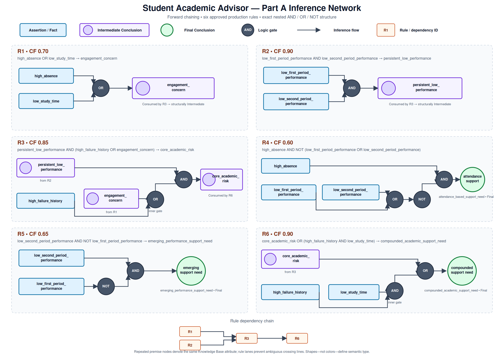
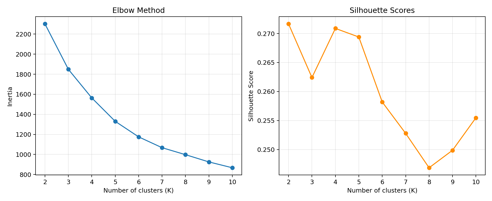
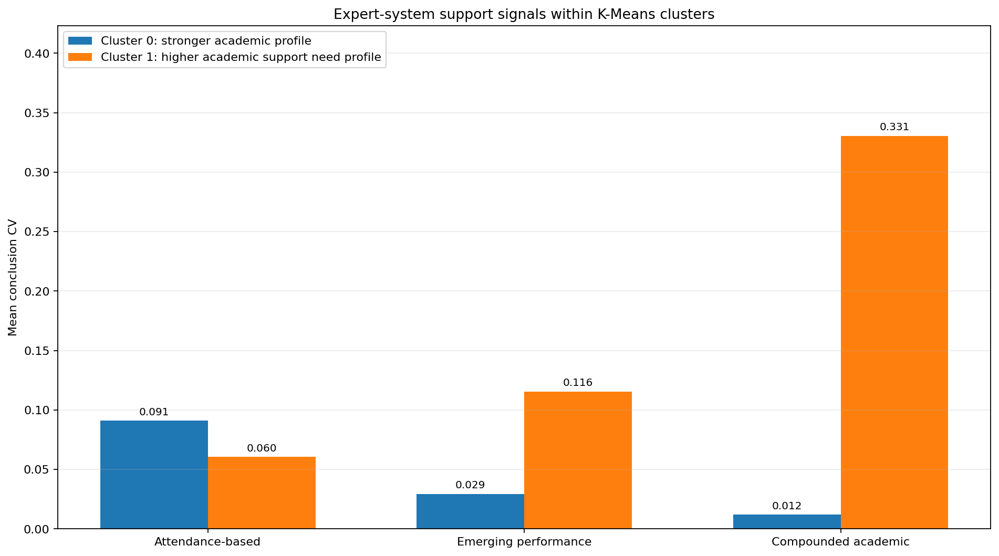

# Student Academic Advisor

## Final Project Report

Course: **Basic of AI Programming Skills (DSC 311)**
Project domain: **Student Academic Advisor**
Part A: **Fuzzy Rule-Based Expert System**
Part B: **K-Means Clustering**
Report version: **1.0**
Date: **2026-08-23**

> Team information and attendance signatures are supplied on the official Cover
> Sheet. No team identity is invented in this report.

## 1. Project Overview

This project implements one Student Academic Advisor using two complementary AI
approaches. Part A reasons about one student using readable Production Rules, fuzzy
facts, forward chaining, and a complete explanation trace. Part B applies K-Means
to discover population-level student profiles without receiving expert labels.

Both parts use the same academic concepts: first-period grade, second-period grade,
absence count, study-time category, and previous-failure history. Their code remains
independent. The relationship between their outputs is analyzed only after both
systems run, preventing cluster labels from becoming invented facts and preventing
expert conclusions from biasing clustering.

## 2. Domain and Objectives

The advisor focuses on early, explainable academic-support signals. It does not
claim to diagnose a student or make a final institutional decision. Its objectives
are to:

1. Represent student evidence as fuzzy degrees rather than only true/false values.
2. Derive transparent academic-support conclusions through readable rules.
3. Record the exact reasoning path and numerical calculations.
4. Discover meaningful student groups with K-Means.
5. Compare individual rule-based reasoning with population-level patterns.

## 3. Part A - Knowledge Representation

### 3.1 Production Rules

The first Knowledge Representation technique is Production Rules. The Knowledge
Base is external JSON data and every rule contains separate `id`, `condition`,
`conclusion`, `cf`, and `description` fields. The condition does not contain `IF`
or `THEN`. The inference engine interprets the rules and contains no hard-coded
academic conclusions.

Human-readable conditions are tokenized and parsed once into an immutable AST with
`FACT_REF`, `NOT`, `AND`, and `OR` nodes. Precedence is `NOT > AND > OR`, while
parentheses override that order. `eval()` is not used.

### 3.2 Object-Attribute-Value Facts

The second technique is Object-Attribute-Value (O-A-V) representation:

```text
(student_object, fuzzy_attribute, membership_value)
```

Each immutable fact stores the student object ID, an attribute, a value in `[0,1]`,
and an origin of `INITIAL` or `DERIVED`. This representation is a natural match for
a student record and remains distinct from Production Rules.

### 3.3 Separation of Responsibilities

- Raw input validates source-domain values.
- Fuzzification converts the raw values into five initial O-A-V facts.
- The Knowledge Base stores rule content only.
- Working Memory stores one student's initial and derived fuzzy facts.
- The inference engine evaluates rules and writes derived facts.
- The trace records live reasoning evidence.
- Final aggregation operates only on structurally Final Conclusions.

## 4. Initial Fuzzy Facts

The advisor converts five raw values into concern-oriented memberships. Higher
membership always indicates more concern.

| Raw input | Initial fuzzy fact | Approved membership mapping |
|---|---|---|
| `G1` | `low_first_period_performance` | 1 when G1 <= 9; `(12-G1)/3` when 9 < G1 < 12; otherwise 0 |
| `G2` | `low_second_period_performance` | 1 when G2 <= 9; `(12-G2)/3` when 9 < G2 < 12; otherwise 0 |
| `absences` | `high_absence` | 0 when absences <= 2; `(absences-2)/8` when 2 < absences < 10; otherwise 1 |
| `studytime` | `low_study_time` | lookup `{1:1.0, 2:0.5, 3:0.0, 4:0.0}` |
| `failures` | `high_failure_history` | `failures/3` for observed codes 0 through 3 |

The grade transitions use the documented 0-20 grade scale and project-approved
early-period interpretation. Absence anchors use the selected dataset median and
90th percentile rather than an invented institutional attendance policy.

## 5. Full Production Rule Base

| Rule | Condition | Conclusion | CF | Structural status |
|---|---|---|---:|---|
| R1 | `high_absence OR low_study_time` | `engagement_concern` | 0.70 | Intermediate |
| R2 | `low_first_period_performance AND low_second_period_performance` | `persistent_low_performance` | 0.90 | Intermediate |
| R3 | `persistent_low_performance AND (high_failure_history OR engagement_concern)` | `core_academic_risk` | 0.85 | Intermediate |
| R4 | `high_absence AND NOT (low_first_period_performance OR low_second_period_performance)` | `attendance_based_support_need` | 0.60 | Final |
| R5 | `low_second_period_performance AND NOT low_first_period_performance` | `emerging_performance_support_need` | 0.65 | Final |
| R6 | `core_academic_risk OR (high_failure_history AND low_study_time)` | `compounded_academic_support_need` | 0.90 | Final |

Rule descriptions stored in the Knowledge Base are:

- **R1:** Either weak attendance or weak study effort contributes an
  engagement-related support signal.
- **R2:** Two sequential academic periods supporting low-performance concern
  indicate persistence across periods.
- **R3:** Persistent low performance is corroborated by failure history or an
  engagement-related concern.
- **R4:** Attendance-based support need when grade-concern membership is limited.
- **R5:** A degree of support need associated with second-period concern when
  first-period concern is limited.
- **R6:** Compounded academic-support need from core risk or combined
  failure-history and study-time concerns.

Intermediate and Final status is not manually stored in the rules. A conclusion is
Intermediate if another rule consumes it; otherwise it is Final. The dependency
edges are R1 -> R3, R2 -> R3, and R3 -> R6.

## 6. Inference Engine and Fuzzy Reasoning

The system implements deterministic forward chaining:

1. Load, parse, and validate the Knowledge Base.
2. Build rule dependencies and detect cycles.
3. Produce a topological order, using declaration order for ties.
4. Initialize one student's Working Memory with all five fuzzy facts.
5. Evaluate each rule once when its premises are available.
6. Record premise values and every operator step.
7. Compute FV from the complete condition.
8. Compute `CV = FV * CF`.
9. Store the CV as the derived conclusion value.
10. Aggregate structurally Final CVs after inference.

Fuzzy operators are:

```text
AND(a,b) = min(a,b)
OR(a,b)  = max(a,b)
NOT(a)   = 1-a
CV       = FV * CF
```

A rule fires when `FV > 0` and contributes when `CV > 0`. There is no configurable
cutoff such as 0.5. A zero-valued derived fact remains defined because a later rule
may apply NOT to it.

The final Knowledge Base summaries are:

```text
Maximum = max(all Final Conclusion CVs)
Union(a,b) = a + b - a*b
```

Union is folded one final value at a time in deterministic order.

## 7. Explainability and Inference Network

The live trace records condition text, premise values, operator steps, FV, CF, CV,
fired/contributes status, derived conclusion, structural status, and evaluation
order. Explanations therefore come from the actual inference run rather than being
reconstructed afterward.



The diagram follows the official convention:

- Square: assertion or initial fact.
- Circle inside a square: Intermediate Conclusion.
- Plain circle: Final Conclusion.
- Labeled AND, OR, and NOT gates: fuzzy condition operations.

## 8. Complete Worked Inference Example

The example uses the real final row of the selected file, identified in the project
as `POR-0649`:

```text
G1=10, G2=11, absences=4, studytime=1, failures=0
```

### 8.1 Initial O-A-V Values

| Fuzzy fact | Calculation | Value |
|---|---|---:|
| `low_first_period_performance` | `(12-10)/3` | 0.666667 |
| `low_second_period_performance` | `(12-11)/3` | 0.333333 |
| `high_absence` | `(4-2)/8` | 0.250000 |
| `low_study_time` | lookup category 1 | 1.000000 |
| `high_failure_history` | `0/3` | 0.000000 |

The resolved order is R1, R2, R3, R4, R5, R6.

### 8.2 R1

```text
FV = OR(0.25, 1.0) = 1.0
CF = 0.70
CV = 1.0 * 0.70 = 0.70
engagement_concern = 0.70
```

### 8.3 R2

```text
FV = AND(0.666667, 0.333333) = 0.333333
CF = 0.90
CV = 0.333333 * 0.90 = 0.300000
persistent_low_performance = 0.300000
```

### 8.4 R3

```text
inner OR = OR(0.0, 0.70) = 0.70
FV = AND(0.30, 0.70) = 0.30
CF = 0.85
CV = 0.30 * 0.85 = 0.255
core_academic_risk = 0.255
```

### 8.5 R4

```text
inner OR = OR(0.666667, 0.333333) = 0.666667
NOT = 1 - 0.666667 = 0.333333
FV = AND(0.25, 0.333333) = 0.25
CF = 0.60
CV = 0.25 * 0.60 = 0.15
attendance_based_support_need = 0.15
```

### 8.6 R5

```text
NOT = 1 - 0.666667 = 0.333333
FV = AND(0.333333, 0.333333) = 0.333333
CF = 0.65
CV = 0.333333 * 0.65 = 0.216667
emerging_performance_support_need = 0.216667
```

### 8.7 R6

```text
inner AND = AND(0.0, 1.0) = 0.0
FV = OR(0.255, 0.0) = 0.255
CF = 0.90
CV = 0.255 * 0.90 = 0.2295
compounded_academic_support_need = 0.2295
```

### 8.8 Final Aggregation

Final CVs are `0.15`, `0.216667`, and `0.2295`.

```text
Maximum = max(0.15, 0.216667, 0.2295) = 0.2295

U(0.15, 0.216667) = 0.334167
U(0.334167, 0.2295) = 0.486975
Final Union = 0.486975
```

The strongest individual conclusion is compounded academic support need. Union
summarizes combined support across all three Final Conclusions and does not replace
their individual meanings.

## 9. Part B - Dataset and Preparation

The project uses the [UCI Student Performance dataset](https://doi.org/10.24432/C5TG7T),
created by Paulo Cortez and distributed under CC BY 4.0. The selected file is
`student-por.csv`, representing Portuguese-language course records.

The source package contains Mathematics and Portuguese files with 382 documented
shared students. They are not concatenated because no true unique student ID is
provided and concatenation could double-count students.

Preparation evidence:

- Raw shape: 649 rows and 33 columns.
- Delimiter: semicolon.
- Missing cells in the selected file: 0.
- Empty strings: 0.
- Exact duplicate rows: 0.
- Training features: `G1`, `G2`, `absences`, `studytime`, and `failures`.
- Encoding: none required for the selected numeric/ordinal matrix.
- Scaling: `StandardScaler`.
- Valid extremes retained; no mechanical IQR deletion.
- `G3` excluded from scaling, K selection, and model fitting.

`studytime` is treated as an ordered code, not as an exact number of hours. G3 is
reserved for post-hoc interpretation so that the clustering remains unsupervised and
avoids including the final outcome in its feature matrix.

## 10. K-Means Implementation and Evaluation

The pipeline uses scikit-learn K-Means with `random_state=42` and `n_init=20`.
Candidate values from K=2 through K=10 were fitted on the standardized matrix.

| K | Inertia | Silhouette Score |
|---:|---:|---:|
| 2 | 2302.167 | **0.2717** |
| 3 | 1848.916 | 0.2624 |
| 4 | 1563.691 | 0.2709 |
| 5 | 1330.206 | 0.2694 |
| 6 | 1175.209 | 0.2582 |
| 7 | 1067.264 | 0.2528 |
| 8 | 997.714 | 0.2469 |
| 9 | 925.246 | 0.2499 |
| 10 | 866.953 | 0.2555 |



K=2 was selected because it has the highest observed Silhouette Score and is more
parsimonious than the close K=4 candidate. The Elbow curve declines gradually
rather than showing one unambiguous sharp elbow. The selected score of 0.2717
indicates overlapping patterns, not two perfectly separated natural classes.

## 11. Cluster Profiles and Interpretation

The names were assigned after fitting and inspecting original-scale profiles.

| Profile | Students | G1 | G2 | Absences | Study time | Failures | G3 post-hoc mean |
|---|---:|---:|---:|---:|---:|---:|---:|
| Stronger academic profile | 332 | 13.380 | 13.593 | 2.401 | 2.286 | 0.012 | 14.033 |
| Higher academic-support-need profile | 317 | 9.325 | 9.451 | 4.978 | 1.558 | 0.442 | 9.678 |

The second cluster combines lower period grades, lower study-time code, more
absences, and more previous failures. Its lower post-hoc G3 supports the academic
relevance of the profile, but G3 was not a training input and the cluster remains a
descriptive group rather than a verified risk label.

## 12. Part A / Part B Integration

For all 649 rows, Part A was run independently and its Final CVs were joined with
the saved K-Means assignment by `source_row`.

| Cluster | Mean Maximum | Mean Union | Attendance contribution | Emerging contribution | Compounded contribution |
|---:|---:|---:|---:|---:|---:|
| 0 | 0.118409 | 0.128029 | 31.33% | 12.35% | 4.82% |
| 1 | 0.386468 | 0.459942 | 23.97% | 42.90% | 86.12% |



The higher-support cluster has a mean Union 3.59 times the stronger-profile
cluster. The largest separation is the chained compounded-support conclusion,
showing broad agreement between the two approaches.

The attendance conclusion is somewhat stronger in Cluster 0. This is not hidden as
a contradiction: R4 specifically represents high absence when low-performance
membership is limited, so it can find an attendance-specific concern among students
whose grades otherwise resemble the stronger profile.

Post-hoc Pearson correlations are `-0.536862` between G3 and Maximum and
`-0.536041` between G3 and Union. These are descriptive associations, not
classification accuracy and not evidence of causality.

## 13. Testing and Reproducibility

The merged project baseline passes **219 automated tests**. Coverage includes raw
validation, all fuzzy boundaries, dataset-wide fuzzification, O-A-V models, parsing,
precedence, malformed syntax, Knowledge Base validation, cycles, deterministic
ordering, Working Memory, CV propagation, trace completeness, Maximum/Union,
K-Means preparation and evaluation, generated outputs, and integration safeguards.

Main reproducible commands:

```bat
python -m pytest -q
python -m student_academic_advisor.expert_system.demo
python -m student_academic_advisor.ml_pipeline.run_pipeline
python -m student_academic_advisor.integration.run_analysis
```

The Part B notebook provides an academic presentation layer while reusable logic
remains in tested Python modules.

## 14. Limitations

- The dataset covers secondary-school students from two Portuguese schools and
  should not be generalized to every educational setting.
- Membership functions and CFs are documented author decisions, not learned
  parameters or institutional policy.
- K-Means assumes Euclidean geometry after scaling and produces overlapping groups.
- Cluster names are interpretations of centroids, not ground-truth labels.
- Part A and Part B share related feature concepts, so observed association is
  expected and does not prove causality.
- The advisor provides support signals, not automatic academic decisions.

## 15. Conclusion

The project satisfies the required Expert System and Machine Learning components as
one coherent Student Academic Advisor. Part A provides transparent individual
reasoning through Production Rules, O-A-V fuzzy facts, forward chaining, dependency
resolution, cycle detection, FV/CF/CV calculations, traceability, and final
aggregation. Part B provides reproducible K-Means preparation, selection,
evaluation, visualization, and post-hoc interpretation.

The integration findings show broad agreement around compounded academic-support
need while preserving a useful rule-specific attendance insight. This demonstrates
why explicit expert reasoning and unsupervised population analysis can complement
each other without being forced into one model.

## References

1. DSC 311, `AI Skills - Course Project`, official project description, Summer
   2026.
2. DSC 311, official Group Project Cover Sheet, Summer 2026.
3. UCI Machine Learning Repository, [Student Performance](https://doi.org/10.24432/C5TG7T).
4. Cortez, P. and Silva, A., *Using Data Mining to Predict Secondary School
   Student Performance*, 2008.
5. scikit-learn documentation, K-Means, StandardScaler, and Silhouette Score.
